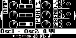

# Performance Page 1/3

1. Synth Patch A selection
    1. double click: mute / unmute
1. Synth Patch B selection
    1. double click: mute / unmute
1. Harmonizer patch selection
    1. double click: mute / unmute
1. Master gain
1. Stereo spread / narrow
1. FX Gain
    1. double click: mute / unmute
1. BPM
    1. double click: Metronome mute / unmute
1. Transpose semitones
1. Scale root
1. Scale flavor

# Performance Page 2/3: Reverb FX

# Performance Page 3/3: Delay FX

# Synth Patch Page 1/x: Overview

1. Patch gain
1. Oscillator stereo spread
1. Oscillator detune
1. Patch verb mix
1. Patch delay mix
1. Macro 1 amount
1. Macro 2 amount
1. Macro 3 amount
1. Macro 4 amount

