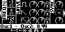
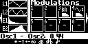

# Performance Page 1/3

1. Synth Patch A selection
    1. double click: mute / unmute
1. Synth Patch B selection
    1. double click: mute / unmute
1. Harmonizer patch selection
    1. double click: mute / unmute
1. Master gain
1. Stereo spread / narrow
1. FX Gain
    1. double click: mute / unmute
1. BPM
    1. double click: Metronome mute / unmute
1. Transpose semitones
1. Scale root
1. Scale flavor

# Performance Page 2/3: Reverb FX

1. Verb size
1. Verb damp
1. Verb gain
    1. double click: verb mute / unmute

# Performance Page 3/3: Delay FX

1. Delay gain
    1. double click: verb mute / unmute
1. Delay time
1. Delay time basis (ms, various note lengths)
1. Delay time stereo spread
1. Feedback gain
1. Feedback filter type
1. Feedback cutoff
1. Feedback saturation
1. Feedback resonance (Q)

# Synth Patch Page 1/x: Overview

1. Patch gain
1. Oscillator stereo spread
1. Oscillator detune
1. Patch verb mix
1. Patch delay mix
1. Macro 1 amount
1. Macro 2 amount
1. Macro 3 amount
1. Macro 4 amount

# Synth Patch Page 2/x: OSC settings page 1

1. Osc1 Amp
    1. double click: mute / unmute
1. Osc1 wave type (square, etc)
1. Osc1 wave shape parameter. TBD
1. Osc1 pulse width
1. Osc1 frequency semis
1. Osc1 frequency finetune

(repeat for Osc2 and Osc3)

# Synth Patch Page 3/x: OSC settings page 2

1. Osc1 Pan
1. Osc1 Portamento time
1. Osc1 Phase
    1. double click: phase restart / phase continuous
1. Osc1 Pitchbend range POSITIVE
1. Osc1 Pitchbend range NEGATIVE
1. Osc1 Pitchbend semitone snap

(repeat for Osc2 and Osc3)

# Synth Patch Page 4/x: FM

1. FM strength Osc2 => Osc1
1. FM strength Osc3 => Osc1
1. FM strength Osc1 => Osc2
1. FM strength Osc3 => Osc2
1. FM strength Osc1 => Osc3
1. FM strength Osc2 => Osc3
1. FM feedback strength Osc1
1. FM feedback strength Osc2
1. FM feedback strength Osc3
1. Osc1 output gain
1. Osc2 output gain
1. Osc3 output gain
1. Osc1 Frequency multiplier
1. Osc2 Frequency multiplier
1. Osc3 Frequency multiplier
1. Osc1 Frequency offset
1. Osc2 Frequency offset
1. Osc3 Frequency offset
1. Overall FM strength

# Synth Patch Page 5/x: Filter

1. Filter type
1. Filter key tracking
1. Filter stereo separator
1. Filter cutoff Hz
1. Filter saturation
1. Filter resonance (Q)

# Synth Patch Page 6/x: Modulation Overview

1. LFO1 submenu
1. LFO2 submenu
1. Env1 submenu
1. Env2 submenu
1. Custom modulation 1 submenu
1. Custom modulation 2 submenu
1. Custom modulation 3 submenu
1. Custom modulation 4 submenu
1. Custom modulation 5 submenu
1. Custom modulation 6 submenu
1. Custom modulation 7 submenu
1. Custom modulation 8 submenu

# Synth Patch Page 7/x: Tools

1. Patch pan
1. Voicing mode: mono / poly
1. Init patch (with confirmation)
1. Copy patch (show list of destination, then confirmation)
1. Init osc1
1. Init osc2
1. Init osc3
1. Copy osc1 to... (show list of destination, then confirmation)

# Synth Patch: Modulation detail

1. Modulation source signal
1. Modulation destination param
1. Modulation source curve strength
1. Modulation source polarity
1. Modulation destination param base value
1. Modulation scale
1. Modulation aux source signal
1. Modulation aux curve
1. Modulation aux polarity
1. Modulation aux scale
    1. double click: aux disable / enable

# Synth Patch: Modulation envelope

1. Env delay time
1. Env attack time
1. Env hold time
1. Env decay time
1. Env sustain level
1. Env release time
1. Env transitional release time

# Synth Patch: Modulation LFO

1. LFO Wave type
1. LFO Wave shape param
1. LFO pulse width
1. LFO frequency
1. LFO frequency basis (ms, various notes)
1. LFO phase offset
    1. double click: LFO phase restart / continuous
